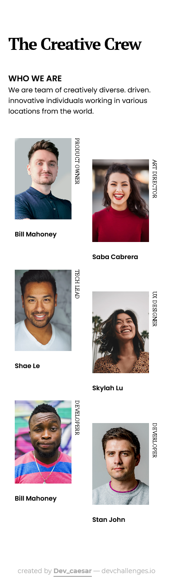

<!-- Please update value in the {}  -->

<h1 align="center">{My Team Page}</h1>

   Solution for a challenge from  <a href="http://devchallenges.io" target="_blank">Devchallenges.io</a>.

  <h3>
    <a href="https://{your-demo-link.your-domain}">
      Demo
    </a>
     | 
    <a href="https://{your-url-to-the-solution}">
      Solution
    </a>
     | 
    <a href="https://devchallenges.io/challenges/hhmesazsqgKXrTkYkt0U">
      Challenge
    </a>
  </h3>

<!-- TABLE OF CONTENTS -->

## Table of Contents

- [Overview](#overview)
- [Built With](#built-with)
- [Contact](#contact)

<!-- OVERVIEW -->

## Overview

### Built With

<!-- This section should list any major frameworks that you built your project using. Here are a few examples.-->

- [CSS3](https://www.w3.org/Style/CSS/Overview.en.html)
- [HTML5](https://developer.mozilla.org/en-US/docs/Web/HTML)

## Contact

- GitHub [@dev_caesar](https://{github.com/dev_caesar})
- Twitter [@dev_caesar](https://{twitter.com/dev-caesar})
